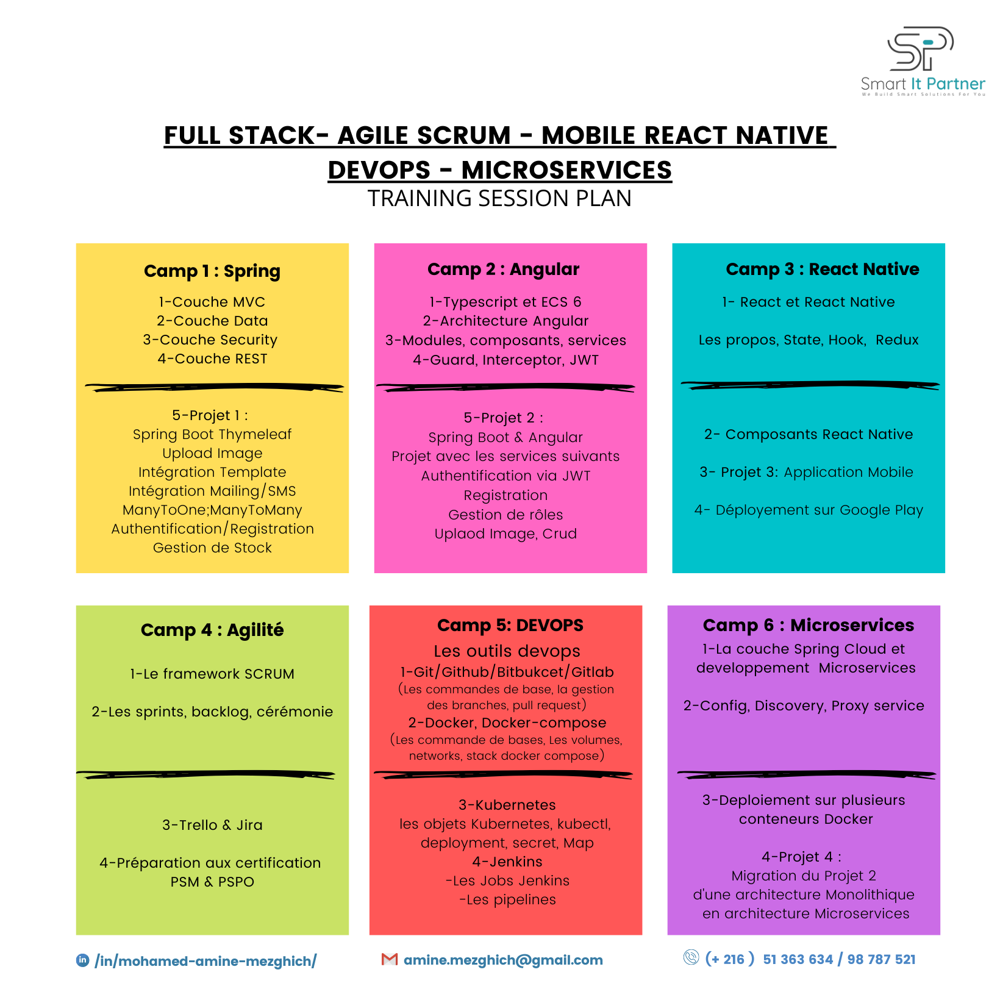

# AMS - Application Management Services

## Overview

AMS is my first web application built on the Spring MVC framework using Maven 3.0.2 and Java JDK 17. The application was created as a learning project to gain experience with key Spring MVC concepts and technologies. The following concepts have been covered as part of this project :

### 1. The SpringBoot project structure
- Setting custom parameters for our project
- SpringBoot structure, default package, main class
- Resource/static and Resource/template folders
- Manage dependencies using Maven and pom.xml file
- Properties file, changing port
- Running SpringBoot project

### 2. The SpringBoot MVC Layer
- Create a custom controller, action, annotation
- Create a view/model and transfer data between view/controller
- Using Thymleaf templating engine
- Adding CSS file
- Deployment of the application on remote free server
- Adding unitary tests using JUnit

## Getting Started

To run the project, you will need to have Maven and Java JDK 17 installed on your system. You can use your preferred Integrated Development Environment (IDE) to run the project. Here are the steps to run the project in Spring Tool Suite (STS):

### Step 1

Open STS and import the project.

### Step 2

Right-click on the project and select "Run As" > "Spring Boot App".

### Step 3

Once the application is running, you can access it by navigating to http://localhost:8081 in your web browser.

Note that the port number has been changed from the default 8080 to 8081.

## Contributing

If you would like to contribute to the project, please fork the repository and create a pull request with your proposed changes. Be sure to follow the project's coding standards and include appropriate tests with your changes.

## Dependencies

The following dependencies were used in the creation of this project:
- Spring Boot DevTools
- Thymeleaf
- Spring Web

## Available Endpoints

- http://localhost:8081/ gets you to the index
- http://localhost:8081/contact/details details about me
- http://localhost:8081/simple/info simple info about how many hours is this bootCamp for Spring
- http://localhost:8081/simple/data list of contacts interface can edit and delete from the list
- http://localhost:8081/provider/list list of providers interface can see details, edit and delete from the list
- http://localhost:8081/provider/add add a new provider interface

## License

This project is licensed under the MIT License - see the  file for details. Feel free to use this code in your own projects or modify it to fit your specific needs.
